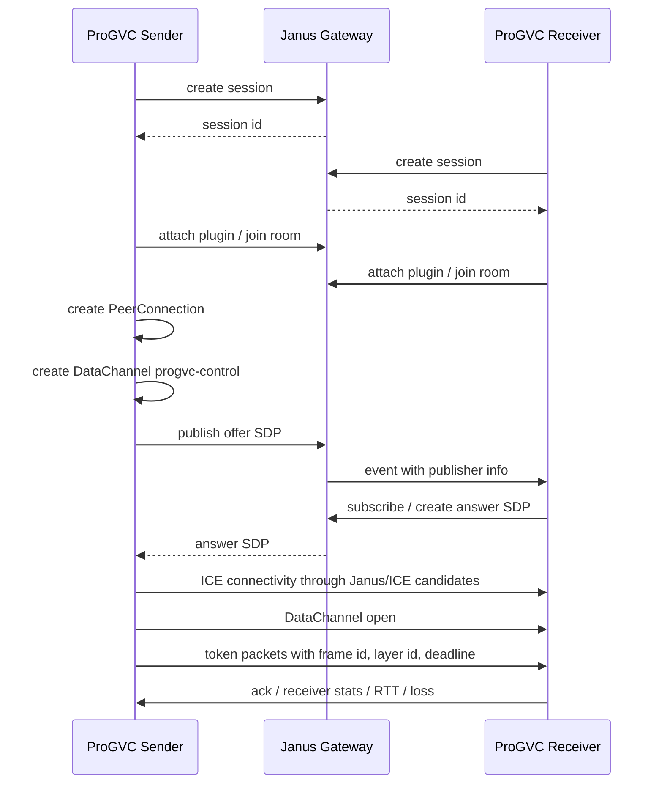

# WebRTC Signaling Flow

```mermaid
sequenceDiagram
    participant Sender as ProGVC Sender
    participant Janus as Janus Gateway
    participant Receiver as ProGVC Receiver

    Sender->>Janus: create session
    Janus-->>Sender: session id
    Receiver->>Janus: create session
    Janus-->>Receiver: session id
    Sender->>Janus: attach plugin / join room
    Receiver->>Janus: attach plugin / join room
    Sender->>Sender: create PeerConnection
    Sender->>Sender: create DataChannel progvc-control
    Sender->>Janus: publish offer SDP
    Janus->>Receiver: event with publisher info
    Receiver->>Janus: subscribe / create answer SDP
    Janus-->>Sender: answer SDP
    Sender->>Receiver: ICE connectivity through Janus/ICE candidates
    Sender->>Receiver: DataChannel open
    Sender->>Receiver: token packets with frame id, layer id, deadline
    Receiver->>Sender: ack / receiver stats / RTT / loss
```

The local `aiortc` smoke test uses the same PeerConnection and DataChannel steps, but exchanges SDP directly inside one Python process instead of routing through Janus.
